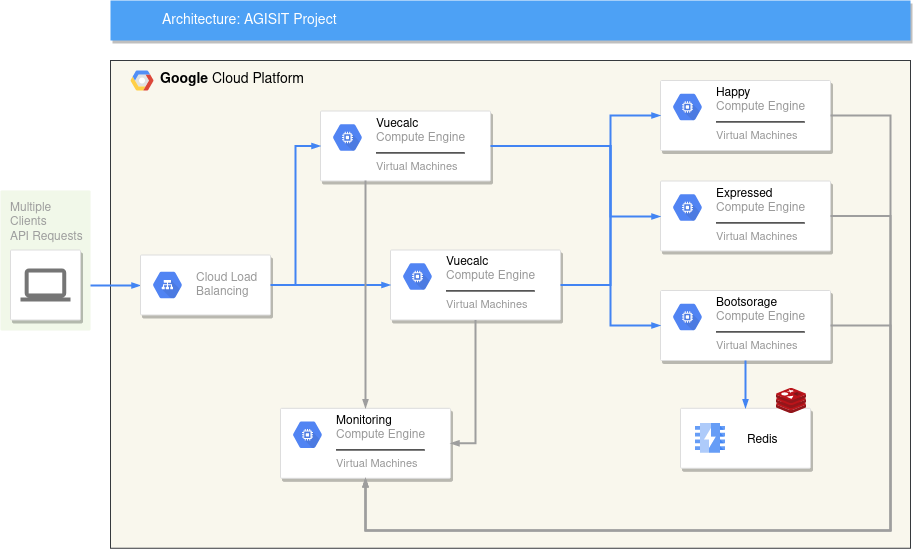

# Project README

AGISIT 2022-2023

## Authors 

**Group 28**

| Number | Name                                       | 
| -------|--------------------------------------------| 
| 90697  | Afonso Basto de Almeida Ribeiro Bate       |           
| 93746  | Pedro Henriques Marques                    |
| 90763  | Pedro Caldeira Alexandre Próspero Luís     | 
| 93613  | Sebastião Zoio Martins Ferreira dos Santos |  

## Instructions

To start folow Lab04 of AGISIT course until 1. Generating the Google Cloud credentials, including it.

Next we have to configure terraform to the project and region you defined before. To do this you have to change the terraform-gcp-variables.tf in the correct places, variable "GCP_PROJECT_ID" and variable "GCP_ZONE" respectively. 

After you will have to provision the infrastructure and to do so you will need:
``` 
$ terraform init
$ terraform plan
$ terraform apply
```
Terraform apply will output the external ip's of every server and you will use it to populate gcphosts. Redis ip is used in the Seventh Play of the playbook in wich you will put it's ip in the respective var, redis_host.

Finnaly you will install and configure every microservice in the respective servers. To do so execute this command in the terminal:
```
$ ansible-playbook ansible-gcp-servers-setup-all.yml
```

## Solution



We based our project on the Browser-based Calculator application presented to us in the Capstone Project Specification. 

As we can see, first there is a load balancer, which receives the users’ requests and distributes them to the Vuecalc microservice. Vuecalc is a frontend application, that renders the calculator UI. There are two backend services, Expressed and Happy, which are rest api based implementations that allow the calculator to perform addition, subtraction, multiplication and division operations. There is also a third backend service, Bootstorage, and has the two primary purposes: store executed operations inside Redis and return the list of operations stored in Redis sorted in the order of execution. Redis is a gcp memorystore instance that serves as persistent data storage. Finally, we have a monitoring server that automates the process of monitoring and logging each microservice.

## Application Usage

For the application usage we have a tutorial on youtube:

- [Video](https://www.youtube.com/watch?v=wOqEbsOVv74&ab_channel=PedroMarques)
